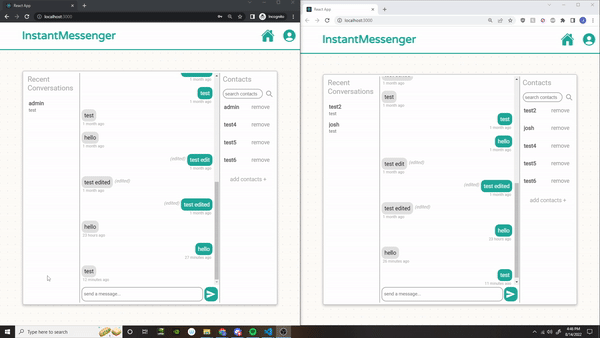

# instant-messenger
This is a real time chat app I created to demonstrate my skills as a web developer. 

### Prerequisites

All you'll need in order to test out the site is a device with internet connection and a browser, but if you want to clone the repo, you'll need to have Node installed, as well as access to a MONGODB account. After cloning, you will need to run the following command: 

```
npm i
``` 

You'll also need to create a .ENV file that contains the following:

```
MONGODB_URI = <your mongodb uri here>
PASS_PHRASE = <your pass phrase here>
JWT_SEC = <your jwt secret here>
```

after doing that, you can start up the development server using the following command: 

```
npm run dev
```

## Demo


## Usage
As you can see from the demo above, the app allows you to send, edit, and delete messeges in real time. But in order to do that, you'll need an account, and another account to send messeges to. So, you can either create your own account, or you can log in to one of the 9 existing test accounts. The information for these accounts are as follows:

``` 
Usernames: test1, test2, test3, test4, test5, test6, test7, test8, & test9
Password: 12345678
```

All 9 test accounts already have each other added, so all you need to do after logging in is send a message.

If you created your own account, you can add a contact to send messages to using this button: 


You will then see a popup that looks like this


just enter the username of the account you'd like to send a message to, and you're all set!

## Built With
* [React](https://developer.mozilla.org/en-US/search?q=html)
* [CSS](https://developer.mozilla.org/en-US/search?q=CSS)
* [Socket.io](https://www.mysql.com/)
* [Node.js](https://developer.mozilla.org/en-US/docs/Web/JavaScript)
* [MongoDB](https://www.mysql.com/)

## Deployed Link

* [See Live Site](https://whispering-thicket-43771.herokuapp.com/)

## Author

**Josh Gumperz** 

- [Link to Github](https://github.com/JoshGumperz)
- [Link to LinkedIn](https://www.linkedin.com/in/josh-gumperz-8706a8185/)

## License

This project is licensed under the MIT License 